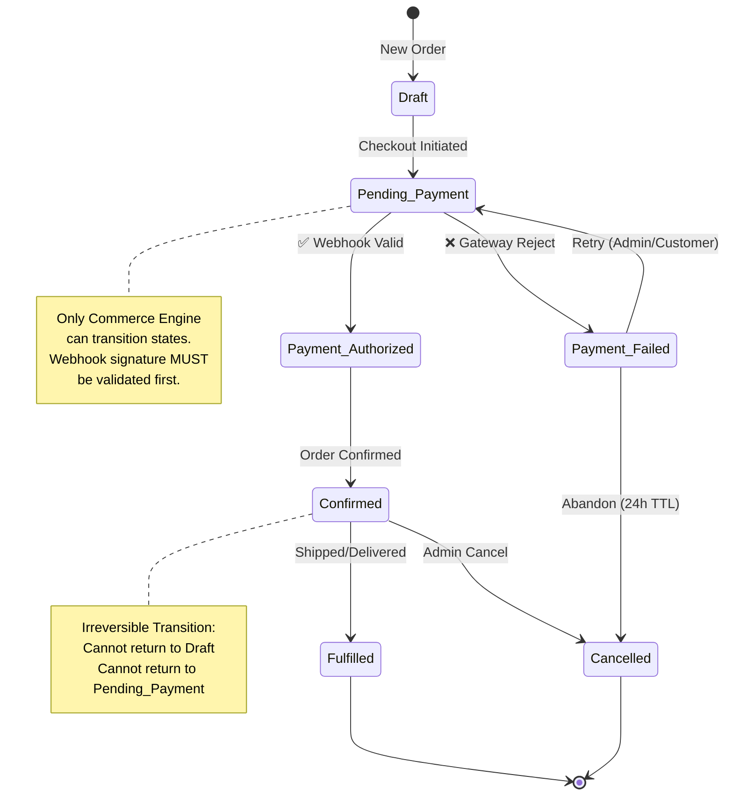
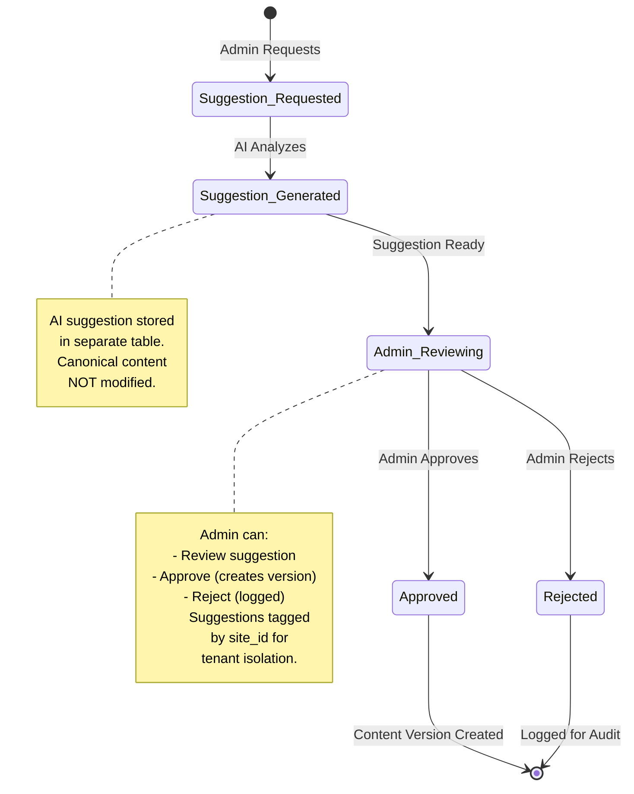
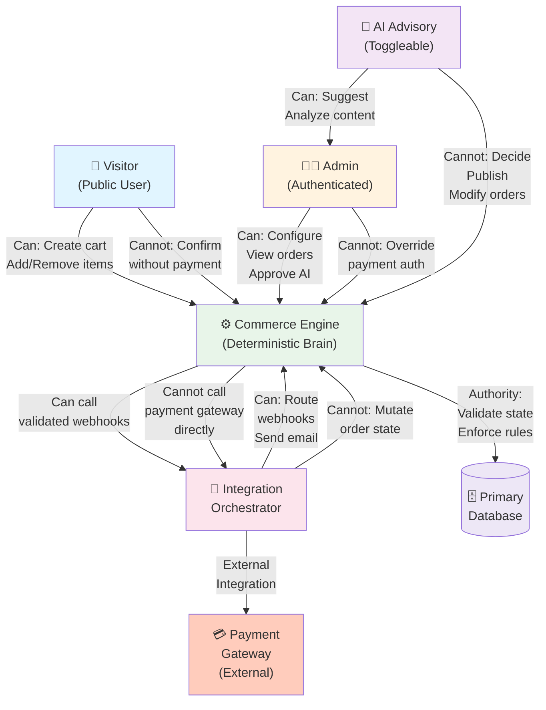
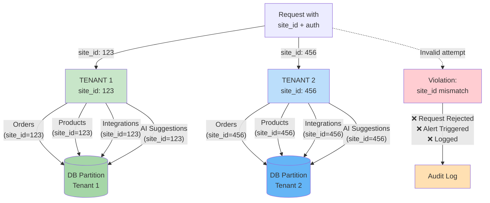
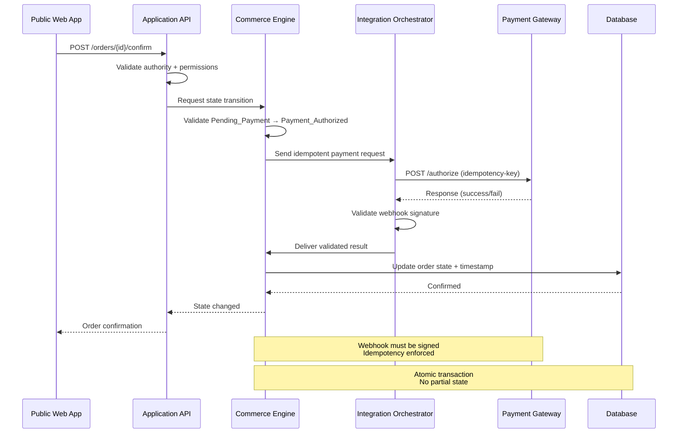
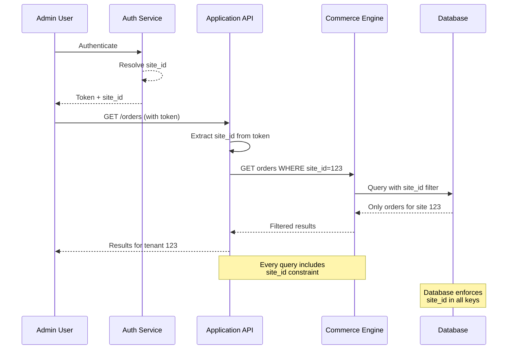

# BEHAVIORAL DIAGRAMS - MERMAID VISUALIZATIONS

**Architect Execution Framework — Phase 3 Visualizations**
**AEGIS Layer 2 — Architecture & Design Layer**
**Visual Reference for State Machines & Authority Chains**

---

## 1️⃣ ORDER LIFECYCLE STATE MACHINE

### Rules

🔒 **Only Commerce Engine transitions states**
🔒 **Webhook must be validated before state mutation**
🔒 **No AI involvement in payment state**
🔒 **No direct admin override of payment authorization**
🔒 **Idempotency enforced on all transitions**

---

## 2️⃣ AI ADVISORY APPROVAL WORKFLOW

### Rules

🔒 **Canonical content untouched until Approved**
🔒 **All suggestions tagged by site_id**
🔒 **Full audit trail required**
🔒 **If AI disabled → Requested state cannot occur**
🔒 **AI cannot write directly to canonical tables**

---

## 3️⃣ AUTHORITY CHAIN DIAGRAM

### Enforcement

🔒 **AIService cannot call CommerceEngine directly**
🔒 **IntegrationOrchestrator cannot mutate order state**
🔒 **Database writes only through controlled containers**
🔒 **Payment Gateway cannot create orders independently**
🔒 **Visitor cannot confirm order without payment**

---

## 4️⃣ TENANT ISOLATION BOUNDARY

### Critical Principle

🔒 **Every entity must include site_id**
🔒 **No cross-site query allowed**
🔒 **Database-level constraints enforced**
🔒 **Future database-per-site migration requires zero domain rewrite**
🔒 **Violation = immediate architectural breach alert**

---

## 5️⃣ FAILURE CONTAINMENT MAP

```mermaid
graph TD
    PF["💳 PAYMENT FAILURE<br/>Zone: Payment Gateway"]
    PF -->|"Blast Radius:"| PF_BR["Single Order Only<br/>No cascade"]
    PF -->|"Containment:"| PF_CONT["Retry Queue<br/>Idempotency Keys<br/>24h Recovery"]
    PF -->|"State:"| PF_STATE["Pending_Payment<br/>OR<br/>Payment_Failed"]
    
    AF["🤖 AI FAILURE<br/>Zone: AI Advisory Service"]
    AF -->|"Blast Radius:"| AF_BR["Admin UX Only<br/>Zero Impact"]
    AF -->|"Containment:"| AF_CONT["Returns unavailable<br/>UI disables advisory<br/>No DB writes"]
    AF -->|"State:"| AF_STATE["Content unaffected<br/>Commerce proceeds"]
    
    IF["📧 INTEGRATION FAILURE<br/>Zone: External Services"]
    IF -->|"Blast Radius:"| IF_BR["Notifications Only<br/>Commerce Proceeds"]
    IF -->|"Containment:"| IF_CONT["Retry Queue<br/>Exponential Backoff<br/>Dead Letter Queue"]
    IF -->|"State:"| IF_STATE["Order completes<br/>Payment authorized<br/>Fulfillment proceeds"]
    
    DBF["🗄️ DATABASE FAILURE<br/>Zone: Primary Database"]
    DBF -->|"Blast Radius:"| DBF_BR["Entire System<br/>Fail-Safe Mode"]
    DBF -->|"Containment:"| DBF_CONT["Read-only mode<br/>No partial commits<br/>Failover to replica"]
    DBF -->|"State:"| DBF_STATE["New writes blocked<br/>Public cached<br/>Admins notified"]
    
    style PF fill:#ffcdd2
    style PF_BR fill:#ef9a9a
    style PF_CONT fill:#e57373
    style PF_STATE fill:#c62828
    
    style AF fill:#f3e5f5
    style AF_BR fill:#e1bee7
    style AF_CONT fill:#ce93d8
    style AF_STATE fill:#7b1fa2
    
    style IF fill:#fff9c4
    style IF_BR fill:#ffe082
    style IF_CONT fill:#ffd54f
    style IF_STATE fill:#f9a825
    
    style DBF fill:#cfd8dc
    style DBF_BR fill:#b0bec5
    style DBF_CONT fill:#90a4ae
    style DBF_STATE fill:#37474f
```

### Principles

🔒 **Each failure has bounded blast radius**
🔒 **Does not corrupt canonical state**
🔒 **Does not cascade uncontrollably**
🔒 **Clear recovery paths defined**
🔒 **Admin notification on critical failures**

---

## 6️⃣ PAYMENT FLOW WITH VALIDATION

---

## 7️⃣ TENANT ISOLATION IN REQUEST FLOW

---

## Key Diagram Principles

### State Machines
- ✅ All states explicitly defined
- ✅ Transitions deterministic
- ✅ No implicit state inference
- ✅ Invalid transitions rejected

### Authority Chains
- ✅ Clear component boundaries
- ✅ Single responsibility per component
- ✅ No authority leakage
- ✅ Explicit permission checks

### Tenant Isolation
- ✅ site_id on all entities
- ✅ Database-level enforcement
- ✅ Request-level validation
- ✅ Violation detection + alerting

### Failure Containment
- ✅ Bounded blast radius
- ✅ No cascade failures
- ✅ Canonical state protected
- ✅ Clear recovery paths

---

**Diagrams Version**: 1.0
**Mermaid Version**: 10+
**Status**: Foundation Phase
**Last Updated**: February 15, 2026
**Next Phase**: Level 4 - Component Protocols (API Contract Details)
