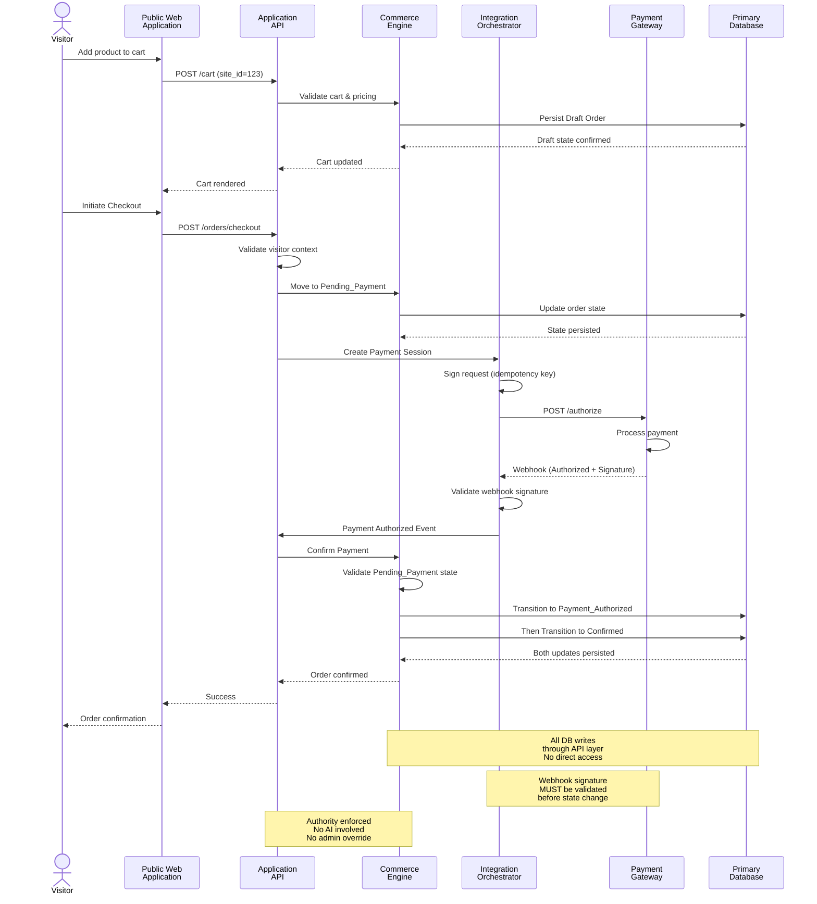
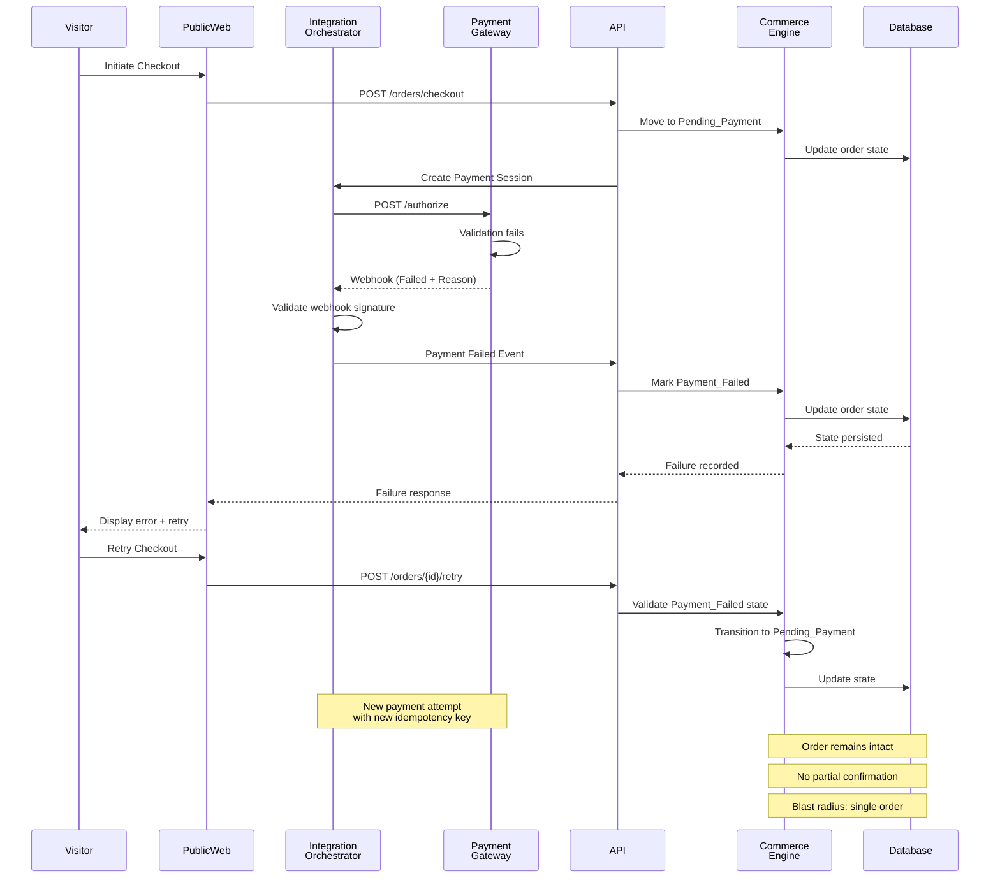
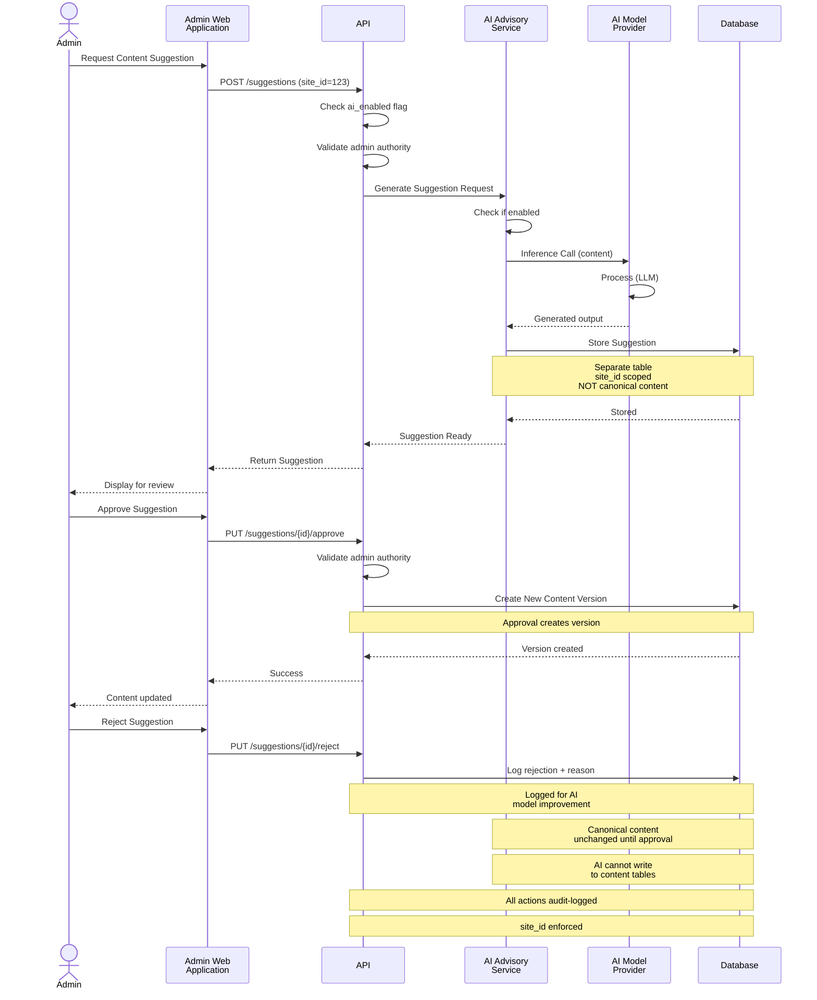
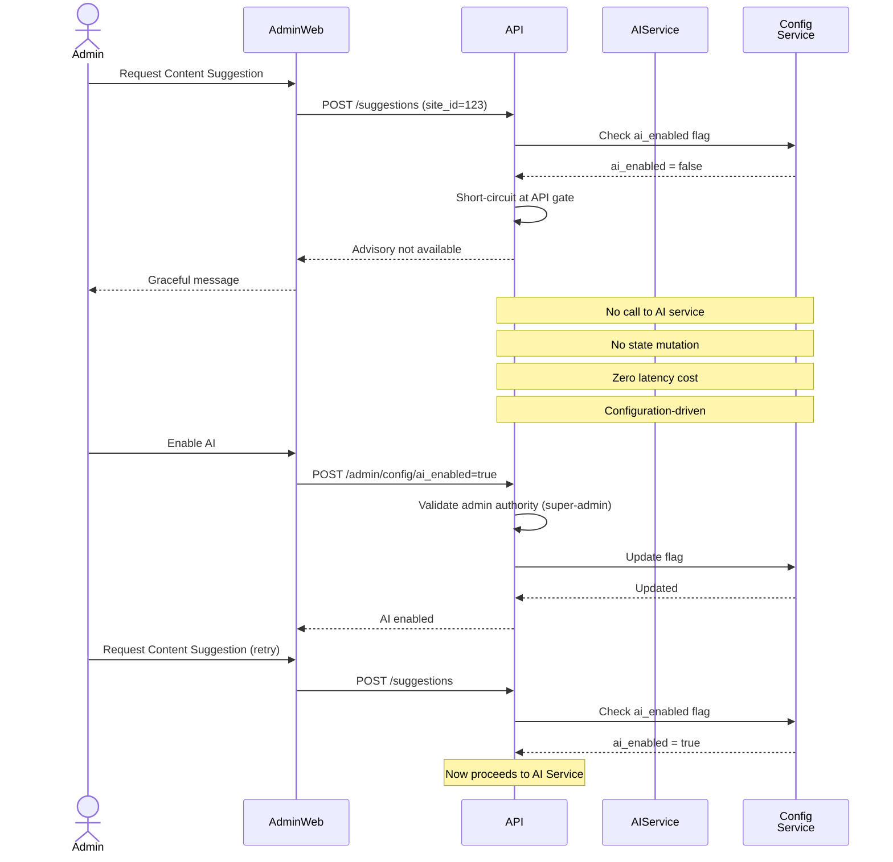

# RUNTIME SEQUENCES - TRANSACTION FLOWS

**Architect Execution Framework — Phase 3 Runtime**
**AEGIS Layer 2 — Architecture & Design Layer**
**Deterministic Authorization & State Transition Flows**

---

## Overview

Runtime sequences define how the system behaves during actual operations. Each sequence enforces authority checks, prevents state ambiguity, and ensures all critical actions are auditable.

**Principle**: No skipped authority gates. Every transition is validated.

---

## 1️⃣ PUBLIC PURCHASE FLOW (Happy Path)

### Observations

🔒 **Only Commerce Engine mutates order state**
🔒 **Payment must be validated before confirmation**
🔒 **No AI in flow**
🔒 **No direct DB write from Integration layer**
🔒 **site_id embedded in all requests**
🔒 **Idempotency key prevents duplicate charges**
🔒 **Visitor cannot confirm order without payment**

---

## 2️⃣ PAYMENT FAILURE FLOW

### Containment Strategy

🔒 **Order remains intact** - no partial state
🔒 **No cascade failure** - other orders unaffected
🔒 **Visitor can retry** - 24h recovery window
🔒 **Blast radius: single order only**
🔒 **Admin can manually refund if stuck** - explicit action required
🔒 **All failure reasons logged** - audit trail preserved

---

## 3️⃣ AI ADVISORY SUGGESTION FLOW (AI Enabled Mode)

### Critical Guarantees

🔒 **Suggestion stored separately** - separate DB table
🔒 **Canonical content unchanged until approval** - immutable until explicit action
🔒 **AI cannot write directly to content tables** - advisory only
🔒 **All suggestions site-scoped** - site_id tagged
🔒 **Admin approval required** - no auto-publish
🔒 **Full audit trail** - timestamp + admin action logged
🔒 **Rejections recorded** - data for model improvement

---

## 4️⃣ AI DISABLED MODE (V1 Runtime - Default)

### Graceful Degradation

🔒 **No external call when disabled** - configuration-driven short-circuit
🔒 **No state mutation** - zero impact on system
🔒 **Zero latency cost** - immediate API response
🔒 **Explicit message** - admin knows AI is disabled
🔒 **Runtime toggle** - can enable/disable without restart
🔒 **Suggested state cannot occur** - if disabled, Suggestion_Requested is impossible

---

## Authority Gates (Enforcement Points)

### Public Purchase Flow

1. **Entry Gate**: Visitor identity verified (anonymous/authenticated)
2. **Cart Gate**: Visitor can only modify own cart
3. **Checkout Gate**: Visitor must have valid shipping/billing
4. **Payment Gate**: Only validated webhook can confirm payment
5. **Confirmation Gate**: Only Commerce Engine can move to Confirmed

### AI Suggestion Flow

1. **Entry Gate**: Admin identity verified + role checked
2. **AI Gate**: ai_enabled flag checked
3. **Suggestion Gate**: Only AI service can create suggestions
4. **Approval Gate**: Only admin can approve (not AI)
5. **Publish Gate**: Approval creates version, doesn't overwrite canonical

### AI Disabled Gate

1. **Config Gate**: ai_enabled = false at API layer
2. **Short-circuit**: Request rejected before AI service touched
3. **Message Gate**: Graceful response with "Advisory Disabled"

---

## Key Invariants (Non-Negotiable)

✅ **No state is inferred** - only explicit transitions accepted
✅ **No authority leakage** - every action gated
✅ **No implicit approval** - admin action always required
✅ **No transaction loss** - atomic DB commits or full rollback
✅ **No ambiguous state** - state machine is exhaustive
✅ **No skipped validation** - all inputs validated
✅ **No silent failures** - all failures logged + alerted
✅ **No cross-tenant leakage** - site_id enforced at every layer

---

## Testing These Flows

### Happy Path Testing
- ✅ Verify cart persists across sessions
- ✅ Verify payment confirmation updates order state atomically
- ✅ Verify webhook signature validation rejects invalid signatures
- ✅ Verify site_id isolation (admin1 cannot see admin2's orders)

### Failure Path Testing
- ✅ Verify failed payment doesn't corrupt order
- ✅ Verify retry uses new idempotency key
- ✅ Verify 24h recovery window enforced
- ✅ Verify failure logs are immutable

### AI Path Testing
- ✅ Verify suggestion stored separately
- ✅ Verify canonical content unchanged until approval
- ✅ Verify approval creates new version
- ✅ Verify rejection is logged
- ✅ Verify site_id scopes suggestions
- ✅ Verify ai_enabled flag gates all AI calls
- ✅ Verify disable returns graceful message

### Authority Testing
- ✅ Verify visitor cannot confirm without payment
- ✅ Verify admin cannot override payment
- ✅ Verify AI cannot mutate order state
- ✅ Verify Integration layer cannot mutate state directly

---

**Runtime Sequences Version**: 1.0
**Status**: Foundation Phase
**Last Updated**: February 15, 2026
**Next Phase**: Level 4 - Component Protocols (API Contract Details - Request/Response Schemas)
