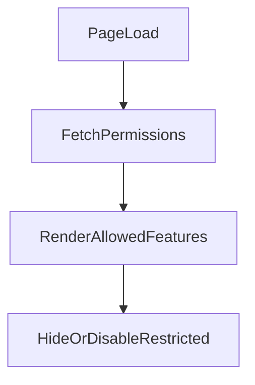

# UI ARCHITECTURE
Admin-First AI-Embedded Website & Commerce Platform

## Phase 11 — UI Architecture (Decision Surface Definition)

Per SOP: UI as Decision Surface, Not Control Plane

We now define:
- What the UI is allowed to do
- What the UI is not allowed to do
- How UI interacts with authority model
- How UI reflects system state truthfully

No visual styling. Only structural authority modeling.

## 1️⃣ UI Responsibility Definition

The UI is a state reflector and decision initiator.

### The UI:
- Displays canonical data
- Initiates actions
- Reflects system state
- Surfaces failure conditions
- Enforces role-based visibility
- Surfaces AI suggestions

### The UI does NOT:
- Decide authority
- Mutate state directly
- Infer permissions
- Validate business invariants
- Transition order states
- Execute payment logic

All authority lives in backend.

## 2️⃣ UI Layers

We have two UI surfaces:
1. Public Interface
2. Admin Interface

They must be isolated logically.

## 3️⃣ Public UI Architecture

### Public Screens (System-Facing)
- Home
- About
- Nested Detail Pages
- Product/Service Listing
- Product/Service Detail
- Cart
- Checkout
- Payment Success
- Payment Failure
- Privacy Policy
- Terms & Conditions
- Contact

### Public UI Authority Model

Public UI can:
- View published content
- Add to cart
- Submit checkout data

Public UI cannot:
- Modify products
- Modify pricing
- Confirm payment without gateway response

### Public UI State Model (High-Level)

Each page must support:
- Loading
- Loaded
- Empty (if applicable)
- Error
- Failure (e.g., payment failure)
- Retry state

No hidden states.

## 4️⃣ Admin UI Architecture

Admin UI is role-aware and tenant-scoped.

Every page must:
- Resolve site context
- Validate membership
- Render features based on permission set

### Admin Screen Inventory

#### Dashboard
- Activity summary
- Orders overview
- AI advisory summary
- Quick links

#### Content Manager
- Page list
- Page editor
- Version history
- AI suggestion panel

#### Product Manager
- Product list
- Product editor
- Pricing configuration
- Visibility toggle

#### Navigation Manager
- Menu structure
- Reordering controls
- Enable/disable links

#### Theme Manager
- Theme preview
- Theme switch confirmation

#### Orders Manager
- Order list
- Order detail
- Status history
- Payment state display

#### Integrations Manager
- Payment provider config
- Credential input
- Enable/disable toggle
- Test integration

#### Global Settings
- Logo upload
- Contact details
- Footer content

## 5️⃣ Role-Based UI Rendering Model

UI must not assume permission.

### UI Flow:

### Rules:
- Unauthorized features are hidden at navigation level.
- Attempting restricted action → backend 403.
- UI reflects denial clearly.
- No UI-only permission enforcement.

## 6️⃣ AI UI Integration Model

AI is embedded but toggleable.

### If AI disabled:
- Suggestion buttons hidden.
- No AI panels rendered.
- No empty advisory placeholders.

### If AI enabled but permission missing:
- AI panel visible but disabled with explanation.

### If AI enabled and permitted:
- Suggestion request button
- Suggestion preview
- Approve / Reject controls
- Audit trail link

AI never auto-applies.

## 7️⃣ UI ↔ Backend Contract Rules

Every action must:
- Send site_id implicitly via resolved context.
- Require explicit permission check.
- Receive canonical response.
- Render returned state only.

UI never assumes success.

## 8️⃣ Order UI State Visibility

Order detail screen must reflect:
- Current order state
- State transition history
- Payment confirmation status
- Failure reason (if any)

No inferred state from frontend logic.

## 9️⃣ Multi-Site UI Context Model

When admin belongs to multiple sites:
- Site selector visible at top level.
- Switching site reloads permission scope.
- No cross-site data mixing.
- URL must reflect site context (subdomain or mapped domain).

## 🔟 UI Failure Model

UI must explicitly support:
- Authentication failure
- Permission denial
- Integration misconfiguration
- Payment failure
- AI unavailable
- Network error
- Session expiration

Each failure must produce:
- Clear state
- Retry option (where valid)
- No silent failure

## UI Architectural Guarantees

✔ UI does not own authority  
✔ UI reflects deterministic backend state  
✔ UI is role-aware  
✔ UI is tenant-scoped  
✔ AI advisory integrated safely  
✔ Commerce state displayed truthfully  
✔ Failure states visible
