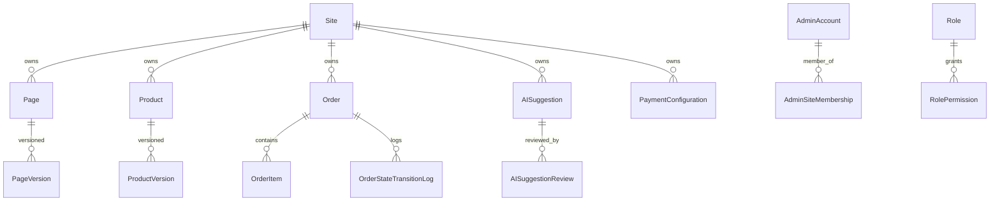

# LOGICAL DATA MODELING
Admin-First AI-Embedded Website & Commerce Platform

## Objective:

Define:
- Entities per domain
- Business-level attributes
- Relationships
- Lifecycles
- Ownership boundaries

No storage decisions.
No indexes.
No tech assumptions.
Pure domain truth.

## 1️⃣ SITE & IDENTITY DOMAIN — LOGICAL MODEL

### Entity: Site

**Attributes:**
- site_id (immutable)
- name
- status (active | suspended | archived)
- created_at
- updated_at

**Lifecycle:**
Created → Active → Suspended → Archived

Cannot delete if orders exist.

### Entity: DomainMapping

**Attributes:**
- mapping_id
- site_id
- domain_name
- type (subdomain | custom)
- is_primary
- verification_status (pending | verified | failed)
- is_active

**Constraints:**
- Domain name must be unique across platform.
- Only one primary domain per site.

### Entity: AdminAccount

**Attributes:**
- admin_id
- email (unique)
- password_hash
- status (active | locked | disabled)
- created_at

**Lifecycle:**
Active → Locked → Disabled

### Entity: Role

**Attributes:**
- role_id
- site_id
- role_name
- description

**Rule:**
Roles are site-scoped.

### Entity: Permission

**Attributes:**
- permission_key
- description

Global, predefined list.

### Entity: RolePermission

**Attributes:**
- role_id
- permission_key

Composite uniqueness enforced.

### Entity: AdminSiteMembership

**Attributes:**
- membership_id
- admin_id
- site_id
- role_id
- status (active | revoked)

**Invariant:**
One admin can have different roles per site.

## 2️⃣ CONTENT DOMAIN — LOGICAL MODEL

### Entity: Page

**Attributes:**
- page_id
- site_id
- slug
- title
- status (draft | published | archived)
- created_at

**Constraint:**
slug unique per site.

### Entity: PageVersion

**Attributes:**
- version_id
- page_id
- content_body
- version_number
- created_by
- created_at
- is_published

**Rule:**
Only one published version per page.

**Lifecycle:**
Draft → Published → Archived

### Entity: SEO_Metadata

**Attributes:**
- metadata_id
- page_id
- meta_title
- meta_description
- structured_data_json

Optional entity (nullable).

### Entity: MediaReference

**Attributes:**
- media_id
- site_id
- file_url
- media_type
- uploaded_by
- created_at

## 3️⃣ PRODUCT & SERVICE DOMAIN — LOGICAL MODEL

### Entity: Product

**Attributes:**
- product_id
- site_id
- title
- short_description
- visibility (visible | hidden)
- status (draft | published | archived)
- created_at

### Entity: ProductVersion

**Attributes:**
- version_id
- product_id
- detailed_description
- inclusion_details
- exclusion_details
- price_amount
- currency
- version_number
- created_at
- is_published

**Rule:**
Only one active published version.

## 4️⃣ COMMERCE DOMAIN — LOGICAL MODEL

### Entity: Cart

**Attributes:**
- cart_id
- site_id
- session_identifier
- status (active | converted | abandoned)
- created_at

### Entity: Order

**Attributes:**
- order_id
- site_id
- order_number
- status (draft | pending_payment | payment_failed | confirmed | fulfilled | cancelled)
- total_amount
- currency
- customer_email
- created_at
- updated_at

**Lifecycle:**
Draft → Pending_Payment → Authorized → Confirmed → Fulfilled
Or
Pending_Payment → Payment_Failed → Cancelled

### Entity: OrderItem

**Attributes:**
- order_item_id
- order_id
- product_id
- product_version_id
- quantity
- price_snapshot
- currency

**Critical:**
price_snapshot immutable after creation.

### Entity: OrderStateTransitionLog

**Attributes:**
- transition_id
- order_id
- from_state
- to_state
- triggered_by (system | admin | webhook)
- timestamp

Append-only.

## 5️⃣ INTEGRATION DOMAIN — LOGICAL MODEL

### Entity: PaymentConfiguration

**Attributes:**
- config_id
- site_id
- provider_name
- is_enabled
- credential_reference_id
- created_at

### Entity: IntegrationCredentialReference

**Attributes:**
- credential_reference_id
- site_id
- encrypted_reference_key
- created_at

### Entity: WebhookEventLog

**Attributes:**
- webhook_event_id
- site_id
- provider_name
- external_event_id
- payload_hash
- processed_status
- received_at

**Invariant:**
external_event_id unique per provider.

### Entity: EmailDispatchLog

**Attributes:**
- dispatch_id
- site_id
- order_id
- email_type
- status (queued | sent | failed)
- timestamp

## 6️⃣ AI ADVISORY DOMAIN — LOGICAL MODEL

### Entity: AISuggestion

**Attributes:**
- suggestion_id
- site_id
- target_type (page | product)
- target_id
- suggestion_content
- status (generated | approved | rejected | expired)
- created_at

### Entity: AISuggestionReview

**Attributes:**
- review_id
- suggestion_id
- reviewed_by
- decision (approved | rejected)
- reviewed_at

### Entity: AIInteractionLog

**Attributes:**
- interaction_id
- site_id
- prompt_hash
- model_identifier
- token_usage
- timestamp

Append-only.

## 7️⃣ AUDIT DOMAIN — LOGICAL MODEL

### Entity: AdminActionLog

**Attributes:**
- log_id
- admin_id
- site_id
- action_type
- entity_type
- entity_id
- timestamp

Append-only.

## RELATIONSHIP SUMMARY (Mermaid ERD)

## LOGICAL MODEL VALIDATION

✔ Every entity belongs to exactly one domain  
✔ All canonical entities include site_id  
✔ No circular ownership  
✔ Immutable logs separated  
✔ Versioning enforced  
✔ Payment state traceable  
✔ AI cannot mutate canonical data directly  
✔ RBAC scoped per site
