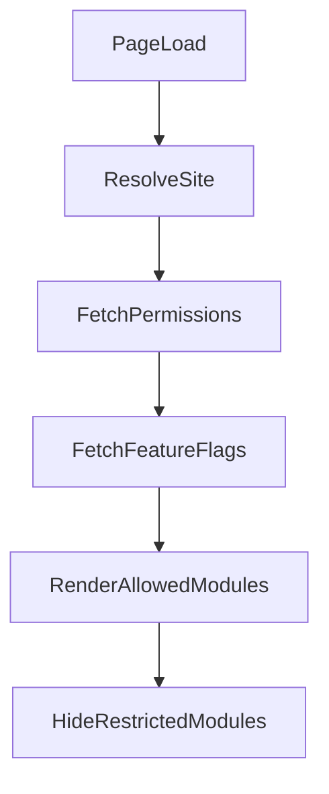

# UI ARCHITECTURE
(Executed Strictly After Data + Invariants + Traceability)

Admin-First AI-Embedded Website & Commerce Platform

## Objective

Define:
- What UI is allowed to do
- What UI must never do
- How UI reflects backend truth
- How UI enforces strict RBAC visually
- How AI advisory appears without authority leakage

UI is a decision surface, not a control plane.

## 1️⃣ UI PRINCIPLES (Derived from Invariants)

From Phase 9, UI must guarantee:
- No state assumed — only rendered from backend.
- No action visible without permission.
- No cross-site data exposure.
- No AI suggestion auto-application.
- No hidden irreversible action.

UI is reactive to backend authority.

## 2️⃣ UI SURFACES

We formally define two isolated UI surfaces:

### A) Public Surface

Accessible via:
- Custom domain
- Platform subdomain

### B) Admin Surface

Accessible via:
- Dashboard subdomain
- Site-scoped routing

No shared rendering logic beyond theme system.

## 3️⃣ PUBLIC UI ARCHITECTURE

### Responsibilities

Public UI:
- Render published content only
- Render visible products only
- Initiate cart & checkout
- Reflect order/payment status
- Display failure clearly

### Public UI cannot:
- Access draft content
- Access unpublished product versions
- Modify state without API confirmation
- Infer payment confirmation

### Public Page Contract

Each page must support these UI states:
- Loading
- Loaded
- Empty (if applicable)
- Error
- Failure (commerce-related)
- Retry (where applicable)

No silent fallback to partial data.

### Checkout UI Contract

Checkout page must:
- Display final pricing snapshot
- Lock pricing during payment initiation
- Disable submit during pending state
- Reflect payment failure explicitly
- Offer retry path without new order creation

Must never:
- Show "Confirmed" without backend confirmation
- Retry without idempotency token

## 4️⃣ ADMIN UI ARCHITECTURE

Admin UI is:
- Tenant-aware
- Role-aware
- Feature-flag-aware (AI toggle)
- Version-aware
- State-aware

All rendering depends on:
- Resolved site context
- Fetched permission set
- Site configuration (ai_enabled)

## 5️⃣ ROLE-BASED UI RENDERING MODEL

### Rendering logic:

### Rules:
- Navigation items not permitted → hidden.
- Permitted but restricted actions → disabled with explanation.
- No optimistic rendering.

## 6️⃣ ADMIN SCREEN STRUCTURE

### Dashboard

Displays:
- Order summary
- Site activity
- AI suggestion queue (if enabled)
- System alerts

No mutation allowed directly from dashboard except navigation.

### Content Manager

Capabilities:
- View pages
- Create draft
- Publish version
- View version history
- Request AI suggestion
- Approve AI suggestion (if permitted)

#### AI Panel:
- Visible only if ai_enabled = true
- Approval button visible only with APPROVE_AI_SUGGESTIONS

### Product Manager

Capabilities:
- View products
- Create/edit draft
- Publish version
- Archive product
- Modify pricing

Deletion blocked if product referenced by confirmed order.

### Orders Manager

Capabilities:
- View orders
- View state transition log
- Cancel (if allowed by state)

Cannot:
- Manually confirm payment
- Override webhook state

### Integrations Manager

Capabilities:
- Configure payment provider
- Enable/disable provider
- Test configuration

Cannot:
- Access raw credential secrets
- Modify order state

### Site & Role Management

Capabilities:
- Assign roles
- Define role-permission mappings
- Invite admin
- Revoke membership

Cannot:
- Assign role across sites
- Modify system-level permissions

## 7️⃣ AI UI INTEGRATION MODEL

| AI State | UI Behavior |
|----------|------------|
| Disabled | AI controls hidden |
| Enabled but no permission | AI panel visible, controls disabled |
| Enabled + permitted | Suggestion workflow active |
| AI service failure | "AI unavailable" state |
| Suggestion pending | Show loading indicator |
| Suggestion generated | Show preview |
| Suggestion approved | Create new version |
| Suggestion rejected | Archive suggestion |

AI must never auto-apply changes.

## 8️⃣ MULTI-SITE UI CONTEXT MODEL

Admin with multiple sites:
- Site switcher required.
- Switching reloads permissions.
- URL reflects site context.
- All navigation scoped to active site.

No mixed-site dashboards.

## 9️⃣ FAILURE VISIBILITY MODEL

UI must explicitly show:
- Authentication failure
- Permission denial (403)
- Payment failure
- Integration misconfiguration
- AI service outage
- Session expiration
- Network failure

Each must have:
- Clear message
- Retry option if valid
- No data corruption

## 🔟 UI–BACKEND CONTRACT RULE

For every UI action:
1. UI sends request.
2. Backend validates authority.
3. Backend returns canonical state.
4. UI re-renders from response.

UI never mutates local state optimistically for irreversible actions.

## UI ARCHITECTURAL GUARANTEES

✔ No authority leakage  
✔ No optimistic irreversible mutation  
✔ No cross-tenant rendering  
✔ AI advisory controlled  
✔ RBAC strictly enforced  
✔ Deterministic commerce reflected  
✔ Failure states explicit
