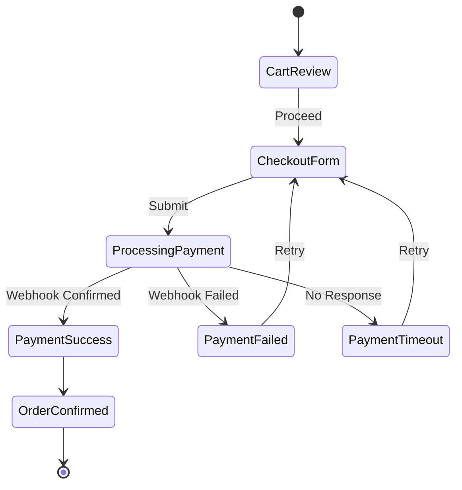
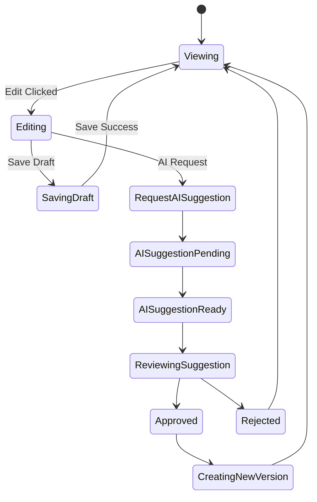
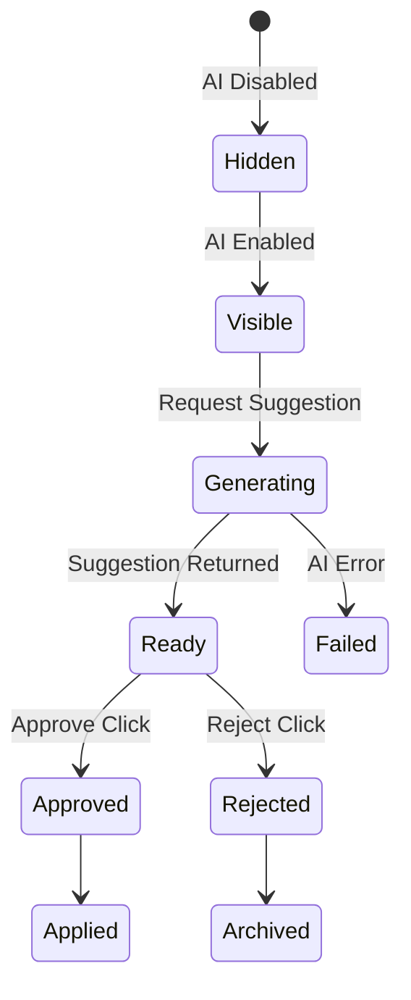
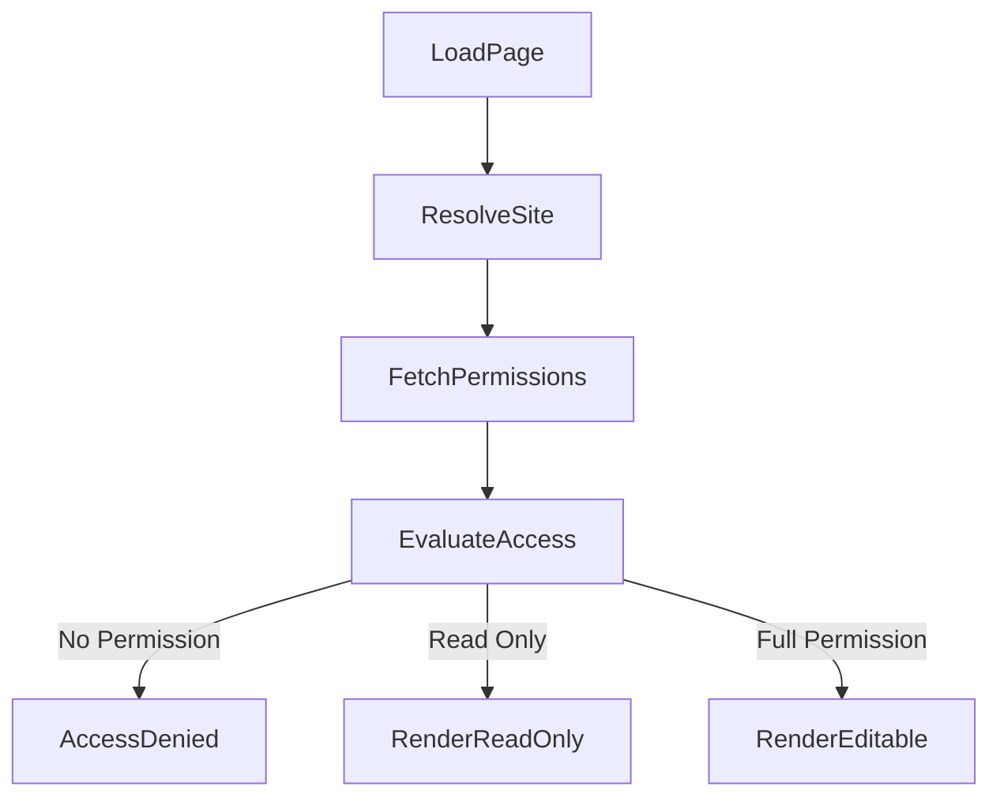
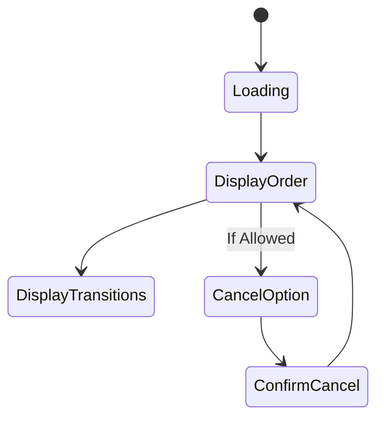
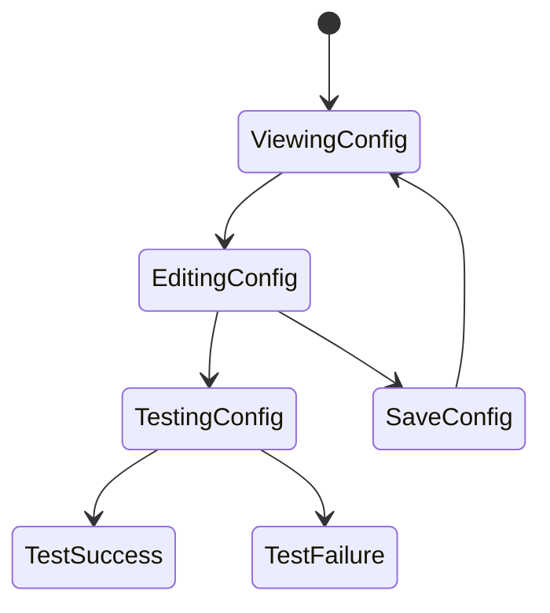
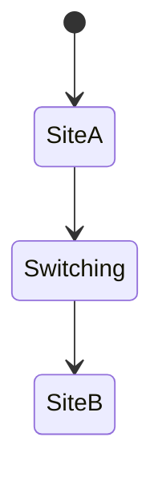
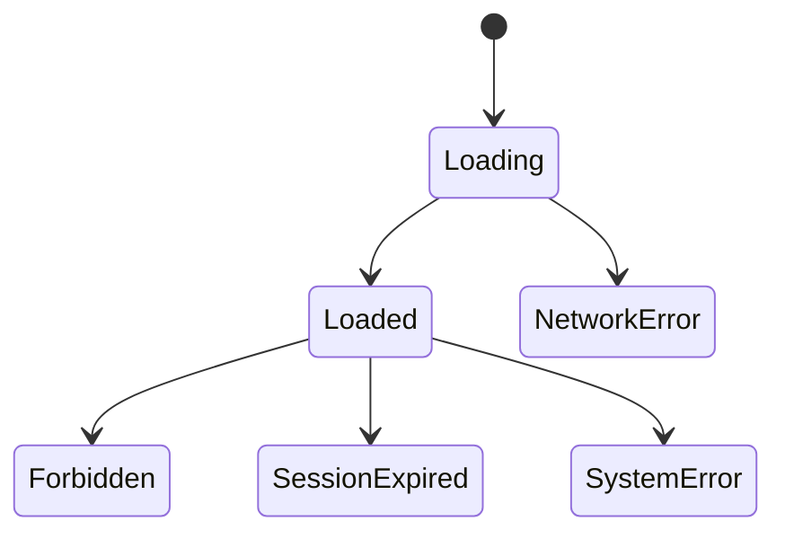

# UI STATE MODELING
Admin-First AI-Embedded Website & Commerce Platform

## Objective:

Define all possible UI states.

We now model:
- Checkout UI state machine
- Content Editor state machine
- AI Suggestion UI state machine
- Role-aware rendering overlay
- Failure state matrix

No visual styling.
Only executable UI truth.

## 1️⃣ CHECKOUT UI STATE MACHINE

This must strictly reflect Order invariants (O1–O4).

### Rules Enforced

- UI cannot enter OrderConfirmed without backend-confirmed state.
- Retry does NOT create new order.
- Pricing locked once entering ProcessingPayment.
- UI polling must validate backend order status.

**Forbidden UI State:**
Showing success before webhook confirmation.

## 2️⃣ CONTENT EDITOR STATE MACHINE

Reflects C2 & C3 invariants.

### Rules:

- Publishing creates new version.
- Editing published version directly is forbidden.
- AI cannot auto-transition to Approved.
- Suggestion must be reviewed before apply.

## 3️⃣ AI SUGGESTION UI STATE MACHINE

Reflects A1–A4 invariants.

### Rules:

- Hidden state if ai_enabled = false.
- No mutation until Approved.
- Failed state must allow retry.
- Suggestion cannot bypass review.

## 4️⃣ ROLE-AWARE UI OVERLAY MODEL

This overlays every admin screen.

### States:

- AccessDenied (403 screen)
- ReadOnly (view-only mode)
- Editable (full action controls)

No controller accessible without permission check.

## 5️⃣ ORDER DETAIL SCREEN STATE MODEL

Reflects O1 + AU2.

### Rules:

- Cancel option only available for valid states.
- State transitions always displayed.
- No manual Confirm button.

## 6️⃣ INTEGRATION CONFIGURATION UI STATES

Reflects IN1–IN3.

### Rules:

- Only one active provider per site.
- Test must pass before enabling.
- No raw credential display.

## 7️⃣ MULTI-SITE CONTEXT SWITCH STATE

### Rules:

- Switching reloads permissions.
- All local state reset.
- No mixed-site data retained.

## 8️⃣ GLOBAL FAILURE STATES

Every screen must support:
- Loading
- NetworkError
- Unauthorized (401)
- Forbidden (403)
- SystemError (500)
- SessionExpired

No silent failure allowed.

## UI STATE CONSISTENCY VALIDATION

✔ All states map to backend invariants  
✔ No unreachable state  
✔ No circular UI state without exit  
✔ No state bypassing authority  
✔ AI state isolated  
✔ Checkout state deterministic  
✔ Role overlay enforced
