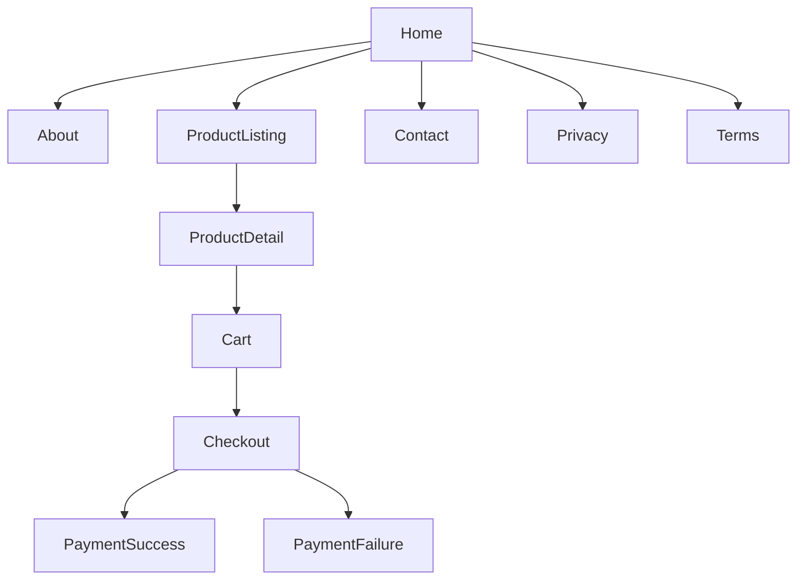
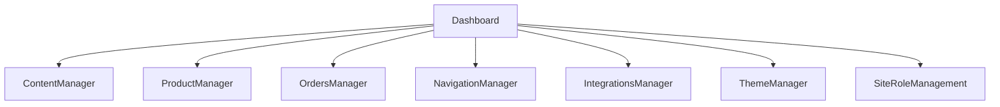
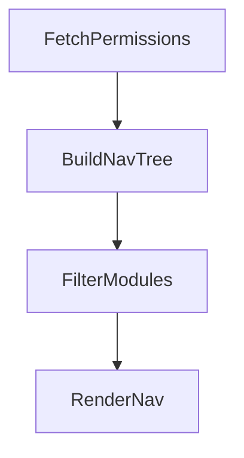

# UI INFORMATION ARCHITECTURE
Admin-First AI-Embedded Website & Commerce Platform

## Objective:

Define:
- Complete screen inventory
- Navigation hierarchy
- Data-to-screen mapping
- Action-to-screen mapping
- Authority visibility per screen
- Tenant scope enforcement

This is structural IA, not visual design.

## 1️⃣ GLOBAL SCREEN INVENTORY

We classify screens into:
- Public Screens
- Admin Screens
- System Screens

### A) PUBLIC SCREEN INVENTORY

| Screen | Purpose | Data Domains | Actions |
|--------|---------|--------------|---------|
| Home | Brand overview | Content | Navigate |
| About | Company narrative | Content | Navigate |
| Nested Detail | Credibility storytelling | Content | Navigate |
| Product Listing | Discover offerings | Product | View detail |
| Product Detail | Full product explanation | Product | Add to cart |
| Cart | Review selections | Commerce | Update / Remove |
| Checkout | Capture customer + payment | Commerce | Submit |
| Payment Success | Confirmation | Commerce | View order |
| Payment Failure | Retry guidance | Commerce | Retry |
| Contact | Inquiry submission | Content | Submit form |
| Privacy Policy | Legal | Content | View |
| Terms & Conditions | Legal | Content | View |

All public screens are:
- Site-scoped
- Read-only except cart/checkout
- Published-content-only

### Public Navigation Hierarchy



### B) ADMIN SCREEN INVENTORY

Admin screens are tenant-aware and RBAC-controlled.

#### 1. Dashboard

**Purpose:**
- Overview summary
- Order metrics
- AI queue
- Alerts

**Data Domains:**
- Commerce
- AI
- Audit

**Permissions:**
- View Dashboard

#### 2. Content Manager

**Screens:**
- Page List
- Page Editor
- Version History

**Data:**
- Content Domain
- AI Domain

**Permissions:**
- MANAGE_CONTENT
- APPROVE_AI_SUGGESTIONS

#### 3. Product Manager

**Screens:**
- Product List
- Product Editor
- Version History

**Data:**
- Product Domain

**Permissions:**
- MANAGE_PRODUCTS

#### 4. Orders Manager

**Screens:**
- Order List
- Order Detail
- Transition History

**Data:**
- Commerce Domain

**Permissions:**
- MANAGE_ORDERS

#### 5. Navigation Manager

**Screens:**
- Menu Structure
- Reorder Links
- Enable/Disable Items

**Data:**
- Content
- Product

**Permissions:**
- MANAGE_CONTENT

#### 6. Integrations Manager

**Screens:**
- Payment Configuration
- Credential Entry
- Test Integration

**Data:**
- Integration Domain

**Permissions:**
- MANAGE_INTEGRATIONS

#### 7. Theme Manager

**Screens:**
- Theme Selection
- Preview
- Apply Confirmation

**Data:**
- Site Configuration

**Permissions:**
- MANAGE_SITE_SETTINGS

#### 8. Site & Role Management

**Screens:**
- Role List
- Role Editor
- Admin Membership List
- Invite Admin

**Data:**
- Identity Domain

**Permissions:**
- MANAGE_SITE_SETTINGS

### Admin Navigation Hierarchy



Each module appears only if permission granted.

## 2️⃣ DATA-TO-SCREEN MAPPING

We now map domain entities to screens.

### Content Domain Mapping
| Entity | Screens |
|--------|---------|
| Page | Page List, Editor |
| PageVersion | Version History |
| SEO_Metadata | Editor |
| MediaReference | Editor |

### Product Domain Mapping
| Entity | Screens |
|--------|---------|
| Product | Product List |
| ProductVersion | Product Editor |
| Inclusion/Exclusion | Product Editor |

### Commerce Domain Mapping
| Entity | Screens |
|--------|---------|
| Order | Order List, Detail |
| OrderItem | Order Detail |
| OrderStateTransitionLog | Order Detail |
| Cart | Public Cart |

### Integration Domain Mapping
| Entity | Screens |
|--------|---------|
| PaymentConfiguration | Integration Settings |
| WebhookEventLog | (Hidden / Debug only) |
| CredentialReference | Integration Settings |

### AI Domain Mapping
| Entity | Screens |
|--------|---------|
| AISuggestion | Content/Product Editor |
| AISuggestionReview | Content/Product Editor |
| AIInteractionLog | Audit / Debug (Restricted) |

## 3️⃣ ACTION-TO-SCREEN MAPPING

Every mutation action must map to exactly one screen.

| Action | Screen |
|--------|--------|
| Publish Page | Page Editor |
| Approve AI Suggestion | Page Editor |
| Archive Product | Product Editor |
| Cancel Order | Order Detail |
| Enable Payment Provider | Integrations Manager |
| Assign Role | Site & Role Management |

No hidden mutation endpoints.

## 4️⃣ TENANT ENFORCEMENT IN IA

All admin URLs must follow:
```
/dashboard/{site_identifier}/module
```

Site identifier resolved via:
- Subdomain OR
- Custom domain OR
- Site switcher context

No global admin route.

## 5️⃣ PERMISSION-DRIVEN NAVIGATION MODEL



If permission missing:
- Module hidden from nav
- Direct route access returns 403

## 6️⃣ AI VISIBILITY IN IA

AI panel appears only inside:
- Page Editor
- Product Editor

Never as standalone module.

AI is contextual, not structural.

## 7️⃣ SYSTEM SCREENS

System-level screens:
- Login
- Session Expired
- 403 Forbidden
- 404 Not Found
- 500 System Error

Must exist outside site-scoped modules.

## IA VALIDATION CHECK

✔ Every domain mapped to screens  
✔ No screen without domain backing  
✔ No domain without screen mapping (except internal logs)  
✔ RBAC integrated into nav  
✔ AI integrated contextually  
✔ Tenant isolation respected  
✔ No hidden mutation path
